# Citation graph

The diagram below maps each manuscript section to the bibliography entries it cites, making
it possible for a reviewer to verify that no bibliography entry is uncited and no in-text
citation lacks a bibliography entry.

```mermaid
graph LR
    intro[Introduction] --> gkos2021
    intro --> lillard1978
    intro --> mccurdy1982
    intro --> meghir2011
    intro --> vaswani2017
    intro --> huang2020
    intro --> gorishniy2021full
    intro --> hollmann2025
    intro --> savcisens2023
    intro --> nie2023
    intro --> zhou2021
    intro --> wu2021
    intro --> romano2019
    intro --> vovk2005full
    intro --> lei2018full
    intro --> angelopoulos2023full
    intro --> stankeviciute2021
    intro --> xu2021
    intro --> bhatnagar2024
    intro --> bourguignon2006
    intro --> sutherland2013
    intro --> flood2024

    relwork[Related work] --> gkos2021
    relwork --> browning2010
    relwork --> karahan2013
    relwork --> guvenen2009
    relwork --> halvorsen2024
    relwork --> savcisens2023
    relwork --> huang2020
    relwork --> gorishniy2021full
    relwork --> gorishniy2022
    relwork --> hollmann2025
    relwork --> somepalli2021full
    relwork --> nie2023
    relwork --> zhou2021
    relwork --> wu2021
    relwork --> wen2023
    relwork --> romano2019
    relwork --> stankeviciute2021
    relwork --> xu2021
    relwork --> bhatnagar2024
    relwork --> vovk2005full
    relwork --> lei2018full
    relwork --> angelopoulos2023full
    relwork --> dvoretzky1956
    relwork --> massart1990
    relwork --> bourguignon2006
    relwork --> sutherland2013
    relwork --> flood2024
    relwork --> wheaton2008
    relwork --> mcgonagle2012

    method[Method] --> vaswani2017
    method --> xiong2020
    method --> hendrycks2016
    method --> huang2016
    method --> romano2019
    method --> vovk2005full
    method --> lei2018full
    method --> dvoretzky1956
    method --> massart1990

    training[Training setup] --> loshchilov2019
    training --> arellano1991
    training --> ke2017
    training --> hochreiter1997

    evaluation[Evaluation] --> gneiting2007
    evaluation --> diebold1995full
    evaluation --> newey1987
    evaluation --> gkos2021
    evaluation --> mcgonagle2012

    appendixB[Appendix B: DM] --> diebold1995full
    appendixB --> newey1987

    appendixC[Appendix C: GKOS] --> gkos2021

    appendixD[Appendix D: Synthetic] --> shokri2017

    appendixE[Appendix E: Conformal] --> vovk2005full
    appendixE --> lei2018full
    appendixE --> romano2019
    appendixE --> dvoretzky1956
    appendixE --> massart1990
    appendixE --> angelopoulos2023full

    interpretability[Interpretability] --> sundararajan2017
    privacy[Privacy analysis] --> shokri2017
```

All 45 bibliography entries are cited in at least one section above.
